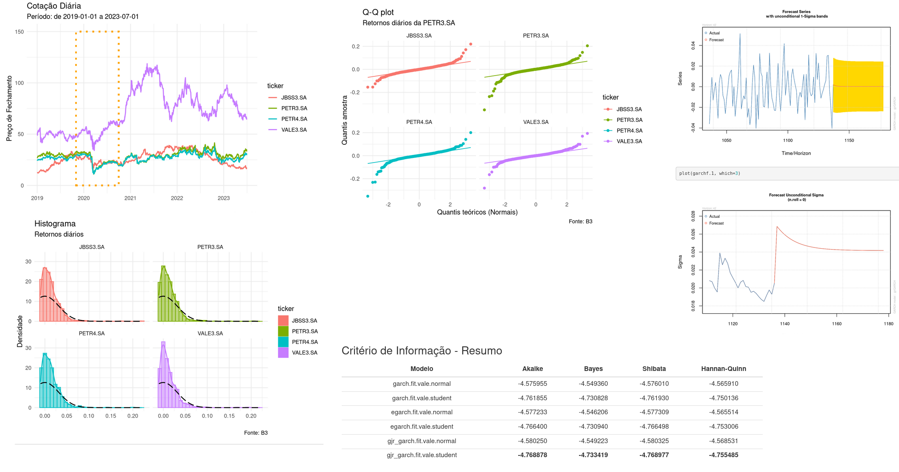

# Códigos feitos no curso Análise de séries temporais financeiras usando o R

Atividades feitas ao longo do curso "Análise de séries temporais financeiras usando o R" oferecido pela UFSCAR, 2023.

Códigos disponibilizados no RPubs: <a href='https://rpubs.com/msc2020'>https://rpubs.com/msc2020</a>.

 

  

 