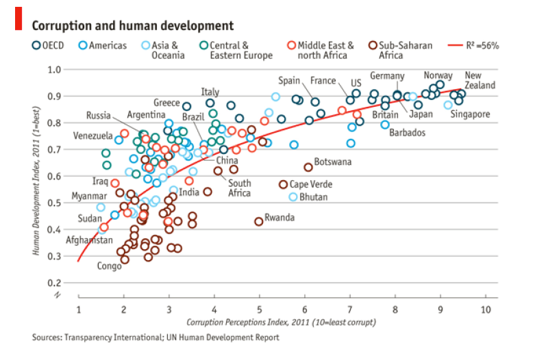

```{r setup, include=FALSE}
knitr::opts_chunk$set(echo = TRUE)
```

## Desafio
Reproduzir uma cópia gráfico abaixo com o R.

```{r, echo=FALSE, fig.cap="fonte: The Economist", out.width = "80%"}

```


Resp:

```{r Desafio}

library(dplyr)
library(ggplot2)
library(readxl)
dataset <- read_excel("dados_desafio.xlsx")
head(dataset)
tail(dataset)
str(dataset)
dataset$CPI <- as.numeric(dataset$CPI)
dataset$HDI <- as.numeric(dataset$HDI)
require("ggrepel")

summary(dataset$CPI)

g <- ggplot(mapping = aes(x=CPI, y=HDI), data = dataset) +
  geom_point(aes(colour=factor(Region)), 
             shape=21, stroke=1.5, size=3, fill = NA) + 
  geom_text_repel(data=dataset %>% 
                    filter(dataset$CPI > 1  | dataset$CPI < 10) %>%
                             sample_n(18),
                  aes(label=Country))+
  scale_x_continuous(limits = c(1, 10.1), 
                     breaks = seq(1, 10.1, 1)) + 
  scale_y_continuous(limits = c(0.1, 1), 
                     breaks = seq(0.2, 1, 0.1)) +
  geom_smooth(method = lm, 
              formula = y ~ splines::bs(x, 3), 
              se = FALSE, color="red", size = 2) +
  labs(title = expression(paste(bold('Corruption and human development'))),
       y = expression(paste(italic('Human Development Index, 2011 (1=best)'))),
       x = expression(paste(italic('Corruption Perception Index, 2011 (10=least corrupt)'))),
       caption = "Sources: Transparency International; UN Human Development Report",
       color = ""
       ) +
  scale_color_manual(name="",
                       labels= c("Americas","Asia &\nOceania","Central &\nEastern Europe", 
                                 "OECD", "Middle East &\nNorth Africa","Sub-Saharan\n Africa"),
                       values=c("blue","cyan","green",
                                "darkgreen","red","brown")) +  
  theme_classic() +
  guides( col = guide_legend(nrow = 1))+
  theme(axis.title=element_text(size=8, face="italic"),
        plot.caption = element_text(hjust = 0.0, size=8),
        axis.line.y = element_blank(), 
        axis.line.x = element_line(lineend="round"),
        axis.ticks.length=unit(0.2, "lines"), 
        axis.ticks.y = element_line(colour= "gray", size=1),
        legend.background=element_rect(fill="white", colour=NA),
        legend.position='top', 
        legend.justification='left',
        legend.direction='horizontal',
        legend.title=element_text(size=rel(0.8), face="bold", hjust=0), 
        panel.background=element_blank(),
        panel.border=element_blank(),
        panel.grid.minor = element_blank(),
        panel.grid.major.y = element_line(colour= "gray",size=1),
        plot.margin=unit(c(1, 1, 0.5, 0.5), "lines"),
        plot.title=element_text(size=rel(1.2)),
        strip.background=element_rect(fill="grey90", colour="grey50"),
        strip.text.y=element_text(size=rel(0.8), angle=-90))

g
```
